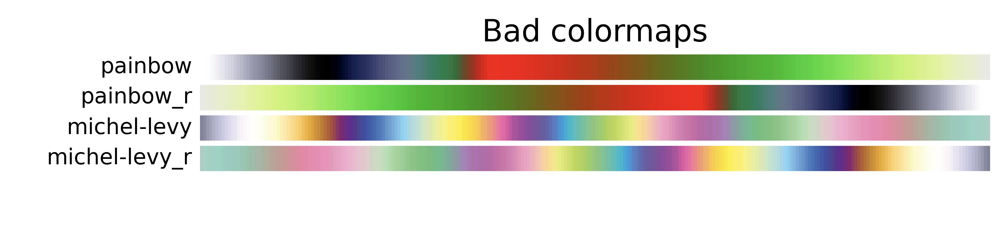
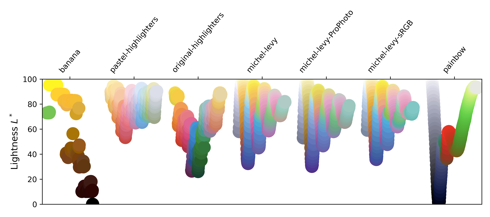

# Bad colo(u)r map

Some bad color maps for [Matplotlib](https://matplotlib.org/) to make plotting amusing figures easier.

## Color maps





Not the most ideal...

## Usage

To use this:

```python
import matplotlib.pyplot as plt
import bad_color_map

plt.XYZ(
    ...
    cmap='painbow'  # or 'michel-levy'
    ...
)

```

## Sources:

- Painbow: [XKCD 2537](https://xkcd.com/2537/)
- Michel-Levy: Bjørn Eske Sørensen; A revised Michel-Lévy interference colour chart based on first-principles calculations. European Journal of Mineralogy 2012;; 25 (1): 5–10. doi: https://doi.org/10.1127/0935-1221/2013/0025-2252